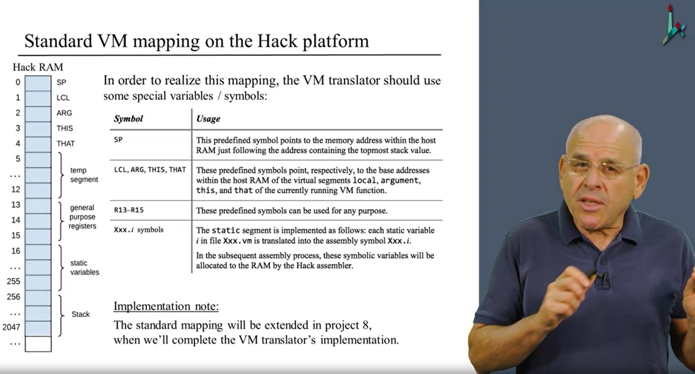

### Notes for Unit 7

## 0.1 Machine Language Primer

### How it works

The von Neumann Architecture which builds on the Universal Turing Machine specifies
a CPU and a Memory Hierarchy.

The CPU implements operations and based on the complexity of the architecture they specify what kind of logic and arithmetic operations are possible.

Register -> Cache -> Main Memory (RAM) -> Disk

Registers: Reside on the CPU and their functionality is part of the op-codes for the cpu
Data Registers: Just store values for the next operation
Address Registers: Store an address to the main memory

I/O
Devices: Keyboard, Mouse, Camera
CPU needs some kind of protocol to talk to them: Drivers
Devices are connected to the cpu through dedicated memory addresses which map on the main address

Flow control

unconditional Jump: Jump to an address or a symbol indicating an address (to loop)
conditional jump: Jump based on a condition to create a decision

### Components of Hack

Hardware design and machine language design go hand in hand.
16-bit computer which means that the smallest unit of information is in chunks of 16 bits
Data Memory (RAM): A sequence of 16-bit registers: RAM[0], RAM[1]...
Instruction Memory
Central Processing Unit
Instruction Bus

Hack Program is a sequence of
16-bit A-Instructions or
16-bit C-Instructions

Program is loaded into the ROM -> Reset -> Program starts running

D (register): Holds a 16-bit value
A (register): Holds a 16-bit value or address
M (register): Represents a 16-bit RAM register addressed by A

A-Instruction

@value (a non-negative decimal constant or a symbol reffering to such a constant)

C-Instruction

dest = comp ; jump (we compute something specifying registers, we can store them in a registers and then optionally jump aftewards)

dest = null, M, D, MD, A, AM, AD, AMD (a combination of destinations is possible to store a value in multiple locations)
comp = 0, 1, -1, D, A, !D, !A, -D, -A, D+1, A+1, D-1, A-1, D+A, D-A, A-D, D&A, D|A, M, !M, -M, M+1, M-1, D+M, D-M, M-D, D&M, D|M 
(The arithmetic and logic operations available and implemented by the CPU Hardware)
jump = null, JGT, JEQ, JGE, JLT, JNE, JLE, JMP (the conditional jump compare the result of comp with 0)
0; JMP (is an unconditional jump)

a jump instruction jumps to the address specified by the A register.

Symbolic <-> Binary

Use an assembler to translate the symbolic assembly language to binary

SCREEN is the label for the base address for the Screen device
KBD is the label for the base address for the Keyboard

# 1. VM and Compilation

## Two-Tier compilation

The task is to translate a high-level language to a low-level machine language.
Problem: Many devices with many different CPUs which have different machine languages.
To fix this Two-Tier compilation the high-level code is compiled to Byte-Code which runs on
a Virtual Machine. Every device needs a Virtual Machine implementation specific to its machine language.
The gap between low-level and high-level is huge and by adding an intermediate step we simplify the process by splitting it in two.

Jack is a Java-like language. Designed for two systems: Personal PC and Hack Computer.

## Stack Abstraction

Needs to strike the balance between sufficiently high to minimize the gap between the high-level language
and sufficiently low to minimize the gap with the low-level language.
Stack Machine is an Architecture that supports Commands to do that.

Has a top and two operations: push and pop.
Push puts one element on the top and Pop removes the top element, updating the pointer accordingly.
This runs in the context of the VM which has a dedicated memory segment, similar to an array.

push x: the value of x is added to the stack
pop y: remove top value from the stack and store it in Y

## Arithmetic logical commands 

The operations are a combination of a pop, operation and push that affects the top-most values on the stack
add, sub, neg, eq, gt, lt, and, or, not (Any logical or arithmetic operation can be expressed by a combination of this commands)

## Memory segment commands

to handle different value types, like local, static or argument variables. The VM Abstraction does not recognize symbolic variables. Instead it stores references to the variables in memory segments: argument, local, static, constant, this, that, pointer, temp

Example:
push static 0
push argument 1
pop local 2

Branching commands
Function commands

## Implementation

### 1. Indirect Addressing with Pointers

D = *p 

@p
A=M
D=M (for Reading) 

or

@value
D=A
@location
M=D (for Assignment)

p--
p++

@p
M=M+1
or
M=M-1

Stack and Segments are mapped to one contiguos RAM segment

SP stored in RAM[0] (Points to next free address on the stack)
Stack base addr = 256

### 2. Memory Segments

For the segment only the base adress is important
'local' is LCL in RAM[1] (local variables)
the base address is added by the index offset to get the target address

pop local i

//addr = LCL+i

//SP--

//*addr = *SP

'argument' -> ARG = RAM[2] (Method arguments)
'this' -> THIS = RAM[3] (Member fields of Object)
'that' -> THAT = RAM[4] (Entries of an Array, e.g.)

The location of the dynamic allocations is arbitrary and irrelevant

'constant' has no pop operation (Is a value in a high-level language)

'static' is stored in global space so that every function can access them
VM Translator needs to translate each reference into an assembly reference
as @VMFileName.i and will be mapped to a memory area that is not on the stack RAM[16..255]

'temp' is a segment of 8 variables that the VM can use 
to allocate values needed for some process in the compilation 
fixed location RAM[5..12]

'pointer' is an arbitrary segment needed for the compilation.
When the compiler translates a function it needs to store the
base address of this and that. Fixed memory with 2 valid locations (0/1 -> THIS/THAT)

push constant 1000
pop pointer 0 

Means that the THIS base address is at 1000

### Next Steps

missing function / return envelope
initializing the stack and the memory segments on the host RAM

## Design

### Architecture

Parser: parses each VM command into its lexical elements
CodeWriter: writes the assembly code that implements the parsed commands
Main: input fileName.vm, output: fileName.asm