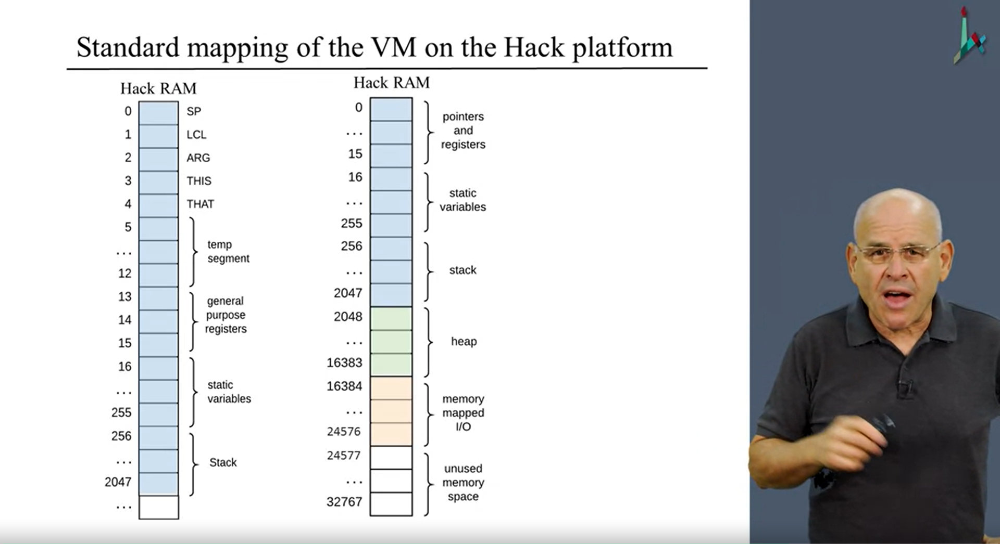

### Notes for Unit 8

## Program Control

### Function

functions such as sqrt, disc are only abstractions that are not part of the core language,
and they are implemented. And high level language allow us to create new functions.
The basic language can be extended at will.

call

function

return

### Branching

goto

if-goto

label

## Branching

### Abstraction

Without branching the program is linear. With branching we enable non-linear execution.
It helps us to implement loops and conditional branching.
The compiler needs to generate Labels and Goto Statements to jump those labels when replacing
the high-level constructs like while, or if.
The condition needs to be pushed on the stack before the branching command, leaving the truth value on the stack.
The implementation in assembly is very similar to that of the VM (goto, if-goto, label).
if-goto pops the top value of the stack affecting the state of the stack.

### Implementation

Is almost the same as the assembly

## Functions

### Abstraction

Subroutines, Functions, Procedures, Methods, Etc. are all abstracted to functions.

sqrt(x - 17 + x * 5)

push x
push 17
sub
push x
push 5
call Math.multiply
add
call Math.sqrt

primitive operations (fixed): add, sub, ...
abstract operations (extensible): multiply, sqrt, ...

Applying a primitive operator and calling a function have the same look and feel
When a function has arguments, they are pushed onto the stack. The function is called.
And the return value of the function replaces those values with a single value on the stack.

function mult n (informs how many local variables the function is going to use)
the Caller and Callee (ist the called function)

function main 0 
push constant 3
push constant 8
push constant 5
call mult 2
add
return

function mult 2
push constant 0
pop local 0
push constant 1
pop local 1
...
push local 0
return

the mult gets an empty stack and two argument values
we push the result in local 0 and put it on the stack
and after return the vm replaces the stack of caller with the value of the callee.

for each function "call":

- Pass parameters from the caller to the callee;
- Determine the return address within the caller's code;
- Save the caller's return address, stack and memory segments;
- Jump to execute the callee;

for each function "return":

- Return to the caller the value computed by the callee;
- Recycle the memory resources used by the callee;
- Reinstate the caller's stack and memory segments;
- Jump to the return address in the caller's code;

### Implementation

a program consists of many programs, only a few are executing at a given time
calling chain foo>bar>sqrt>...

Each function needs to maintain its own state and uses a working stack + memory segments
The working stack and some of the segments should be created when the function starts running,
maintained as long as the function is executing, recycled when the function returns.
When a caller calls the callee we have a state for each.

call foo -> Sets arg -> Saves the caller's frame -> Jumps to execute foo
-> sets up the local segment of the called function -> push a value at the end of the stack

return -> take the top most value and copy it over argument 0 -> restores the segment pointers of the caller
-> clears the stack -> sets SP for the caller -> Jumps to the return address within the caller's code

#### Caller

1. Push as many arguments as the function expects to get
2. Invoke the function using "call" functionName nArgs
3. After the callee returns, the argument values that I pushed have disappeared from the stack
and return value appears at the top of the stack
4. All Memory segments are exactly the same as they were before the call

(Function Name)
push returnAddress (using the label declared below)
push LCL (saves LCL of the caller)
push ARG (saves ARG of the caller)
push THIS ...
push THAT
ARG = SP-5-nArgs (repositions ARG)
LCL = SP (Reposition LCL)
goto functionName
(returnAdress) (declare and inject a label for the return-address)

#### Callee

1. Argument segment is initialized with the argument values passed by caller
2. Local segment has been initialized to zero
3. Static segment has been set to the static segment of the VM File file it belongs too (class It belongs too, as classes are compiled to separate VM Files)
4. Memory segments this, that, pointer and temp are undefined upon entry
5. Working stack is empty
6. Before returning it must push a value onto the stack

(Function Name)
repeat nVars times: (nVars Number of local variables)
push 0              (initialize the local variables to 0)
...
endFrame = LCL      (temporary variable)
retAddr = *(endFrame - 5) (gets return address)
*ARG = pop() (repositions the return value for the caller)
SP = ARG + 1  (repositions SP of the caller)
THAT = *(endFrame - 1) // Restores THAT of the caller
THIS = *(endFrame - 2) // Restores THIS of the caller
ARG = *(endFrame - 3)   // Restores ARG of the caller
LCL = *(endFrame - 4)   // Restores LCL of the caller
goto retAddr           // goes to return address in the caller's code

## VM Specification

- VM Needs to handle reading multiple files and put them into one assembly file.

### Booting

- One File in any VM program is expected to benamed Main.vm
- One Vm function in this file is expected to be named main
- When the VM implementation starts running, it starts with Sys.init (from the OS)
- Sys.init calls Main.main and enters an infinite loop
- Bootstrap code needs to be stored in the HACK Rom starting at address 0

// Bootstrap code 
SP = 256
call Sys.init
...

- VM is only concerned about the blue part (to the stack)

### Symbols

functionName$label

functionName

functionName$ret.i