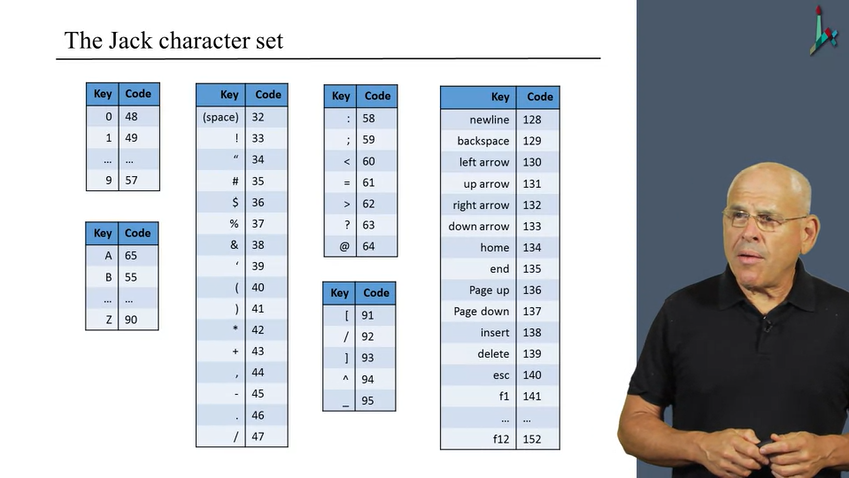

### Notes for Unit 9

## The Jack Language

- Java-Like OO Language, without inheritance
- Minimalistic: can be learned in an hour

### Jack Program

- Is formed out of classes
- Needs a Main class with a main function (void)
- if, while, do
- Array class are given by OS and do not have a type
- Uses OS Services
- Primitive Datatypes: int, char, boolean
- The only way to access field values of a class is through accessor methods (probably because of the static stack bound to a class)
- Jack has methods, constructors and functions
- constructors need to return the object with the this pointer explicitly
- every method needs to return, even if does not return a value
- despose is used to free up memory for the object that is not needed anymore (uses Memory.deAlloc from the OS)

### High-Level OO language

- handle primitive types and class types
- create, represent and dispose objects
- deal with strings, arrays, and lists
- interact with the host OS
- Classes are used to model an abstraction to hide it's implementation details
  - There is client code -> Application which uses the abstraction
  - There is the abstraction code -> Which implements the abstraction
- When we call a method we implicitly pass the object as argument to the method

### Comments

- API Comment -> /** **/
- Block Comment -> /* */
- in-line comment -> //
- White spaces are ignored

###

- Lists, or linked-lists
- Implemented as Objects
- List contains an atomic value and a reference to the tail (remaining list, or better -- next entry)

## Jack Specification

### Syntax

- White space / comments
- keywords: var, let, while, class, constructor, method, function, int, boolean, char, void, static, field, do, if, else, return, true, false, null, this
- Symbols: () -> grouping expressions and for enclosing parameter lists
           [] -> Used for array indexing
           {} -> Used for grouping program units and statements
           ; -> statement terminator
           , -> Variable list separator
           = -> Assignment and comparison operator
           . -> class membership
           + - * / & | ~ < > -> Operators
           ~ -> Boolean negation
- Constants/Literals: Integer, String, Boolean, null
- Identifiers: invented names that a programmer assigns in his program - function, class and variable names

### Data types

#### Primitives

- int: non-negative 2's complement 16-bit integer `[0...32767]`
- boolean: true or false
- char: Unicode character

#### Class types

- OS types: String, Array
- User defined types: Fraction, List, ...

#### Type conversions

- Characters and Integers can be converted to each other
- String -> Char (s.chatAt(0))
- You can't assign a Character as 'A' explicitly, you assign it as the ASCII code number
- Integers can be used as pointers (arr = 5000) because var Array arr creates a pointer
- An Object can be converted to an Array and an Array back to an Object (Arrays are just pointers and objects are just memory spaces allocated on the heap. So one can assign the values of an array to the fields of an object and access it's methods)

### Classes

- Class is the basic compilation unit
- Classname is uppercase
- Each class is stored in a separate Class.jack file
- field -> static variables -> soubroutine (constructors, methods, functions)
- Classes that provide functionality (as a library): contain functions only
- Classes that represent objects: They construct objects that get stored to the heap and contain data aswell as methods

#### OS

- Closes gaps between high-level programs and the host hardware
- provides efficient implementations of commonly-used functions
- Provides efficient implementations of commonly-used ADTs (abstract data types)
- It is a collection of 8 classes
- Similar to Java's standard library

### Methods

- designed to operate on the current object
- get passed the current object implicitly as first argument
- each subroutine must return a value (even void functions: other languages inject return)
- method and function type can be either void, a primitive data type, or a class name

#### Constructors

- 0, 1 or more in a class
- common name: new
- type of the constructor must be the owning class
- the constructor must return a value

#### Variables

- static variables: class-level, can be manipulated by the class subroutines
- field variables: object variables and can only be used by methods and constructors
- local variables: used for local computations within Subroutines
- parameters: to pass in external values to functions

#### Statements

- let for assignment
- if, while
- do statements and function calls that do not return a value (outside of expressions)
- return

#### Expressions

- is an operation that returns a value, can be a constant, a variable in scope, a function call, an array with accessor to its index and a group of subexpressions in paranthesis
- No operator priority! Use paranthesis

#### Subroutine calls

- the number and type of arguments must match with those of the subroutines parameters passed
- Each argument can be an expression 
- methods can be called within the scope of an object without the Class prefix. Functions need to use the Class.function syntax.

## App Structure

- App needs a Main class with a main subroutine
- Folder has the name of the app

#### OS Outputs

- Screen: 256 Rows of 512 pixels, b&w
- Screen class

#### OS Inputs

- Standard Keyboard -> Keyboard class
- Keyboard.keypress returns the currently pressed keycode pressed

"When thinking about efficiency, think about the lower-level"